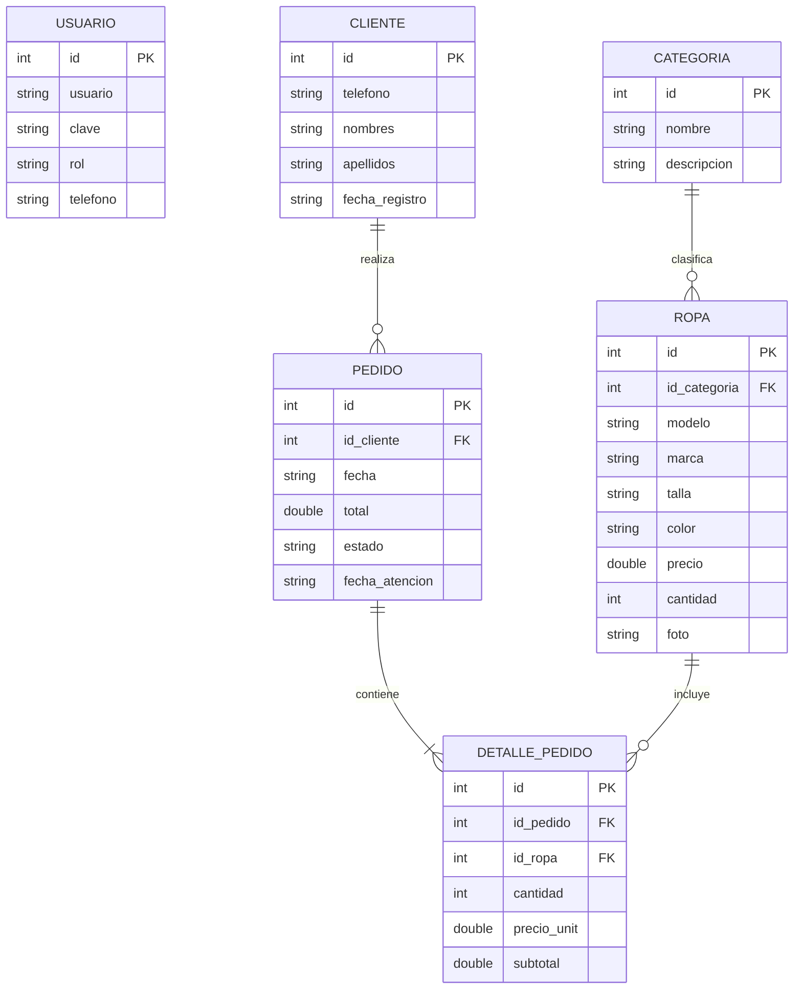

# 🛍️ ModaApp · Boutique Moda Urbana

> **Aplicación Móvil Android para Gestión y Ventas de Tienda de Ropa Urbana**  
> Desarrollado bajo la metodología ágil **Scrum** en 4 Sprints acumulativos.

[](https://developer.android.com/)
[](https://kotlinlang.org/)
[](https://www.sqlite.org/)
[](https://m3.material.io/)

---

## 📱 Descripción del Proyecto

**ModaApp** es una solución móvil integral diseñada para la tienda de ropa **Boutique Moda Urbana**. Permite gestionar el inventario de prendas con fotografías, categorías y control de stock, brindar un catálogo interactivo con carrito de compras para clientes, registrar y atender pedidos comerciales con transacciones SQLite, enviar notificaciones directas por WhatsApp y generar reportes financieros del negocio.

---

## 🎨 Identidad Visual y Diseño (Material Design 3)

- **Color Primario:** Rosa Boutique (`#E91E63`)
- **Color Secundario / Acento:** Carbón / Negro Urbano (`#212121`)
- **Color Primario Oscuro:** Magenta Profundo (`#C2185B`)
- **Superficies y Fondos:** Blanco y Rosa Suave (`#FDFBFC` / `#FCE4EC`)
- **Iconografía:** Iconos vectoriales nativos XML (`VectorDrawable`), sin emojis en la interfaz.
- **Tipografía y Contraste:** Textos nítidos de alto contraste y campos de texto outlined legibles.

---

## 🔐 Credenciales de Acceso

| Usuario | Contraseña | Rol | Acceso |
| :--- | :--- | :--- | :--- |
| `admin` | `admin123` | Administrador | Menú completo, inventario, pedidos y reportes |
| *Acceso Libre* | *(Sin contraseña)* | Cliente | Botón "Ver Catálogo" directo desde el Login |

---

## 🗄️ Arquitectura de Datos (SQLite `modaapp.db`)

La aplicación implementa el patrón **DAO (Data Access Object)** con `SQLiteOpenHelper`:



---

## 🌿 Estructura de Ramas Scrum (Historial Acumulativo)

El repositorio mantiene un flujo acumulativo estricto:

| Rama | Sprints Incluidos | Historias de Usuario | Descripción |
| :--- | :--- | :--- | :--- |
| [`Sprint1`](https://github.com/Mxglzr/modaapp/tree/Sprint1) | Sprint 1 | HU-01, HU-02, HU-03 | Login, Menú Administrador e Identidad Visual Rosa/Negro |
| [`Sprint2`](https://github.com/Mxglzr/modaapp/tree/Sprint2) | Sprint 1 + 2 | HU-04, HU-05, HU-06 | SQLite v1, Registro de Ropa con Fotos y Catálogo |
| [`Sprint3`](https://github.com/Mxglzr/modaapp/tree/Sprint3) | Sprint 1 + 2 + 3 | HU-07, HU-08, HU-09 | SQLite v2, Búsqueda, Carrito y Pedidos con Teléfono |
| [`Sprint4`](https://github.com/Mxglzr/modaapp/tree/Sprint4) | Sprint 1 + 2 + 3 + 4 | HU-10, HU-11, HU-12, HU-13 | WhatsApp, Atención de Pedidos, Reportes, Sesión y APK |
| [`main`](https://github.com/Mxglzr/modaapp/tree/main) | Todos integrados | HU-01 al HU-13 | Rama principal consolidada y lista para producción |

---

## 📋 Historias de Usuario por Sprint

### 🌸 Sprint 1: Login, Menú y Navegación
- **HU-01:** Pantalla de Login con validación de campos, acceso administrador y acceso libre para clientes.
- **HU-02:** Menú principal del administrador con tarjetas de navegación hacia Ropa, Pedidos, Clientes, Reportes y Salir.
- **HU-03:** Identidad visual de marca, paleta rosa y negro, e iconografía vectorial XML.

### 👗 Sprint 2: Base de Datos v1, Ropa y Catálogo
- **HU-04:** Autenticación con SQLite (`UsuarioDao`), consulta parametrizada segura y credenciales precargadas.
- **HU-05:** Formulario de registro de prendas con foto desde galería, selector de categorías, tallas y validaciones.
- **HU-06:** Catálogo visual en cuadrícula de 2 columnas con filtrado dinámico mediante chips de categorías.

### 🛒 Sprint 3: Búsqueda, Carrito y Pedidos
- **HU-07:** Búsqueda de prendas en tiempo real por modelo, marca o color. Edición y eliminación protegida de ropa.
- **HU-08:** Carrito de compras (`Carrito` singleton) con contador dinámico, cálculo de subtotales y eliminación.
- **HU-09:** Búsqueda o registro automático de cliente por teléfono de 9 dígitos y guardado transaccional de pedidos.

### 🚀 Sprint 4: WhatsApp, Gestión, Reportes y APK
- **HU-10:** Integración con WhatsApp (`wa.me`) con mensaje preformateado tanto para el cliente como para la tienda.
- **HU-11:** Atención de pedidos pendientes con confirmación y descuento automático de stock en SQLite.
- **HU-12:** Reportes de ventas del mes en S/., número de pedidos atendidos, stock crítico ($\le 3$) y directorio de clientes.
- **HU-13:** Persistencia de sesión con `SharedPreferences`, cierre seguro y generación del APK final compilado.

---

## 📦 Descarga del APK

El APK compilado y firmado para pruebas se encuentra listo para instalar en:
- Ruta local: `apk/ModaApp.apk`
- Descarga directa: [ModaApp.apk](file:///C:/Users/SENATI/Music/PROYECTOS_ANDROID/MODAAPP/apk/ModaApp.apk)

---

## 🛠️ Cómo Compilar y Ejecutar

1. **Clonar el repositorio:**
   ```bash
   git clone https://github.com/Mxglzr/modaapp.git
   cd modaapp
   ```

2. **Abrir en Android Studio:**
   - Seleccionar `Open` y abrir la carpeta del proyecto.
   - Sincronizar Gradle (`Sync Project with Gradle Files`).

3. **Compilar el proyecto:**
   ```bash
   ./gradlew assembleDebug
   ```

4. **Verificar Base de Datos con Database Inspector:**
   - Ejecutar la aplicación en un emulador o dispositivo físico.
   - Ir a `App Inspection` > `Database Inspector` en Android Studio.
   - Seleccionar el proceso `com.sanchez.modaapp` y abrir `modaapp.db`.